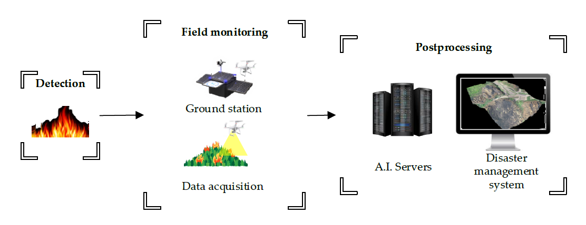
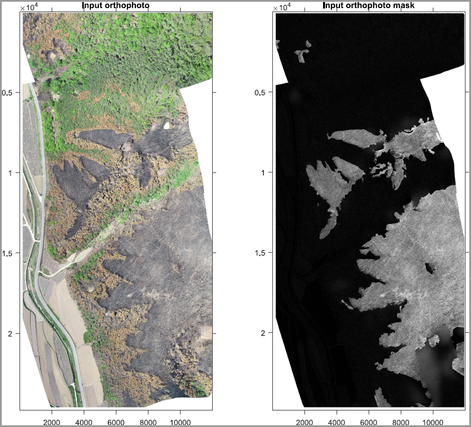
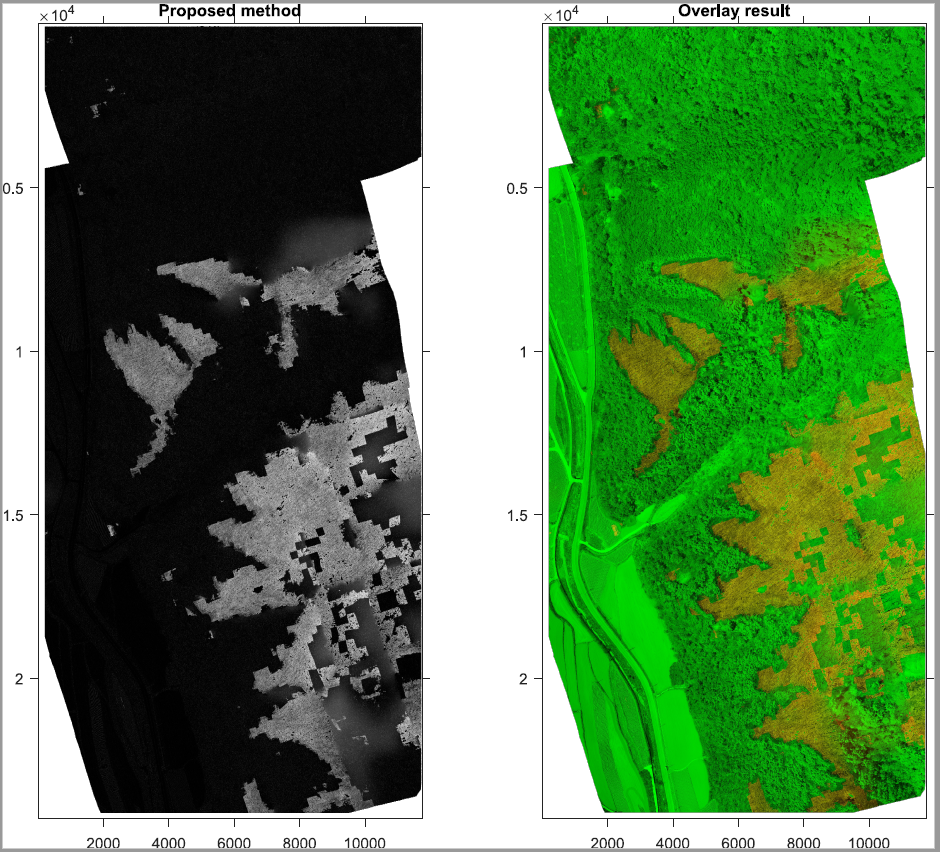

# Damage-Map Estimation Using UAV Images and Deep Learning Algorithms for Disaster Management System

## Introduction
The repo contains all source-code for our proposed approach in the paper entitled "Damage-Map Estimation After Forest Fires Using Drone Images and Deep-Learning Algorithms"


### Forest fire information
Location: Andong, Republic of Korea, in April 2020 

Date: from April 24, 2020 to April 26, 2020
### Data acquisition information
Captured location: Mount 112, Ingeum-ri, Pungcheon-myeon, Andong-si, Gyeongsangbuk-do, 15-3 Haari, Namhu-myeon, Andong-si, Gyeongsangbuk-do

Devices: Phantom 4 Pro V2.0

Date: May 6, 2020
### Burnt area mapping results




## Setup environment

Install [minianaconda](https://docs.conda.io/en/latest/miniconda.html)

`conda install -r requirements.txt`

## Sample data structure 
The sample dataset shows how the implementation is carried out.
```
sample_data/sample_location_1_data
 |
 +-- Img
 |  |
 |  +-- img (1).png
 |  +-- img (2).png
 |  +-- ...
 +-- Label
 |  |
 |  +-- label (1).png
 |  +-- label (2).png
 |  +-- ...
 +-- Orig
 |  |
 |  +-- orig.JPG

sample_data/sample_location_2_data
 |
 +-- Img
 |  |
 |  +-- img (1).png
 |  +-- img (2).png
 |  +-- ...
 +-- Label
 |  |
 |  +-- label (1).png
 |  +-- label (2).png
 |  +-- ...
 +-- Orig
 |  |
 |  +-- orig.JPG
```

## Scripts explaination
Use [train_models](train_models.ipynb) to train the dual models.

With pretrained weights from [this link](https://drive.google.com/drive/folders/1SAv41CwAtO8iWP3WWP2_t4xNfaHiuOFr?usp=sharing)
, use [predict_dual_models](predict_dual_models.ipynb) to predict sample testing dataset.

After receiving the predicted results, [post processing functions](post_processing_functions.mlx) can be used for postprocessing.

The EXIF information can be extracted by using [extract EXIF function](extract_EXIF.ipynb)